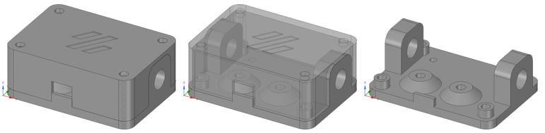

# Under Construction
UNDER CONSTRUCTION - NOTHING TO SEE HERE<br>
<br>


# Filament Runout Sensor Housing
Sensor Housing for Generic CHN Filament Runout Sensor<br>
<br>
<br>
<br>


# BOM
<br>

|Size|Qty|Description|
|---|---|---|
|M3 heat set inserts|6|heat set inserts -> *filamentsensor_body.stl*|
|M3x **??** BHSC|4|screws -> *filamentsensor_cover.stl*|
|M3x **??** SHCS (or BHSC)|2|screws for filamentsensor -> *filamentsensor_body.stl*|
|M3x **??** SHSC (or BHSC)|2|screws for *filamentsensor_body.stl* -> T-Nut|
|M10 4mm OD tube connector|2|tube connector -> *filamentsensor_body.stl*|
|M3 T-Nut|2|extrusion insert|

<br>

# Config
Add the following code to your **printer.cfg**<br>
```
[filament_switch_sensor filament_runout]
pause_on_runout: True
event_delay: 3.0
pause_delay: 0.5
switch_pin: <your pin>
#runout_gcode:
#insert_gcode:
```
<br>

# Changelog
v1.0 (21.10.2022) - Release<br>
<br>
