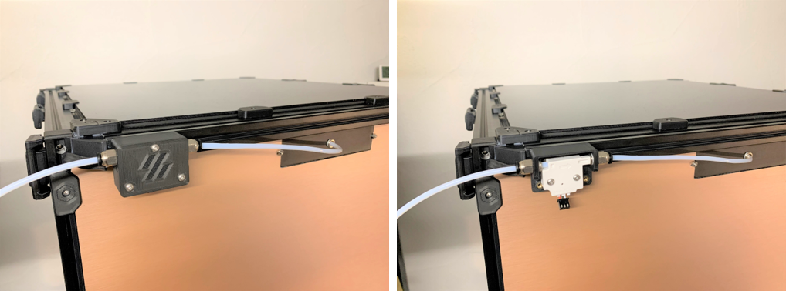
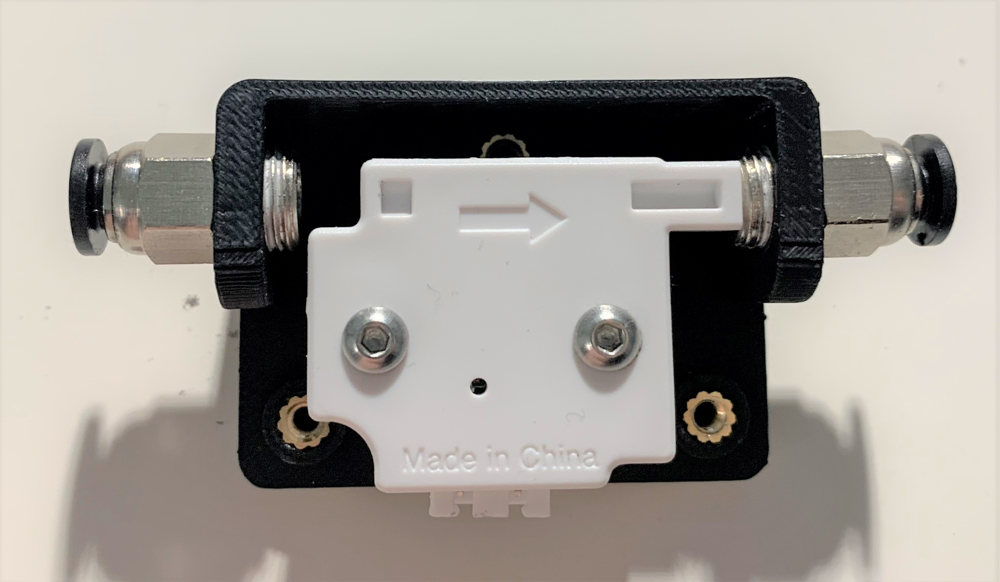
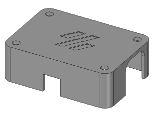
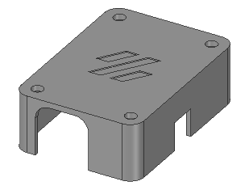
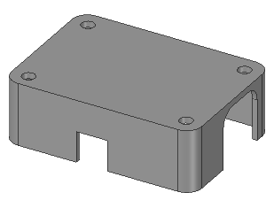

# Project Under Construction

|Work in progress|ToDo|
|:---:|:---|
||- Update STLs to smaller v1.1 version<br>- Update CAD Images to smaller v1.1 version<br>- Update changelog<br>- Delete this note :)|

<br>

# Filament Runout Sensor Housing
Sensor Housing for Generic CHN Filament Runout Sensor
<br><br>

<br>
_**(image depreciated)**_
<br><br>

<br>

<br><br>

# Cover Options
|filamentsensor_cover.stl|filamentsensor_cover_logo-rotated.stl|filamentsensor_cover_nologo.stl|
|---|---|---|
|  |  |  |


# BOM
|Size|Qty|
|---|:---:|
|M3 heat set inserts|5|
|M3x20 BHSC|3|
|M3x16 BHSC|2|
|M3x8 BHSC|2|
|M10 4mm OD tube connector|2|
|M3 T-Nut|2|

_Note:
<br>
BHSC is required_
<br><br>

# Config
Add the following code to your **printer.cfg**
<br>
```
[filament_switch_sensor filament_runout]
pause_on_runout: True
event_delay: 3.0
pause_delay: 0.5
switch_pin: <your pin>
#runout_gcode:
#insert_gcode:
```
_Note:
<br>
`runout_gcode:` triggers only on print active
<br>
`insert_gcode:` triggers only on idle_
<br><br>

# Compatibility

|V0|V1.8|V2.4|VSW|Trident|
|:---:|:---:|:---:|:---:|:---:|
| :heavy_check_mark: | :heavy_check_mark: | :heavy_check_mark: | :heavy_check_mark: | :heavy_check_mark: |

<br>

# Changelog
v1.0 (21.10.2022) - Release
<br>
