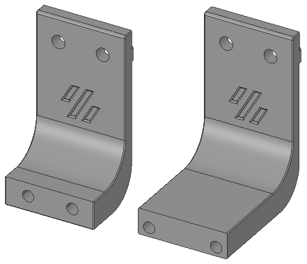
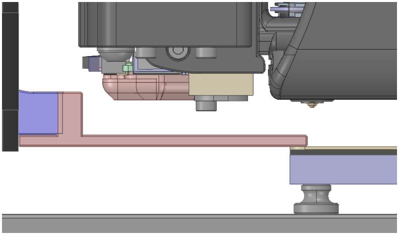
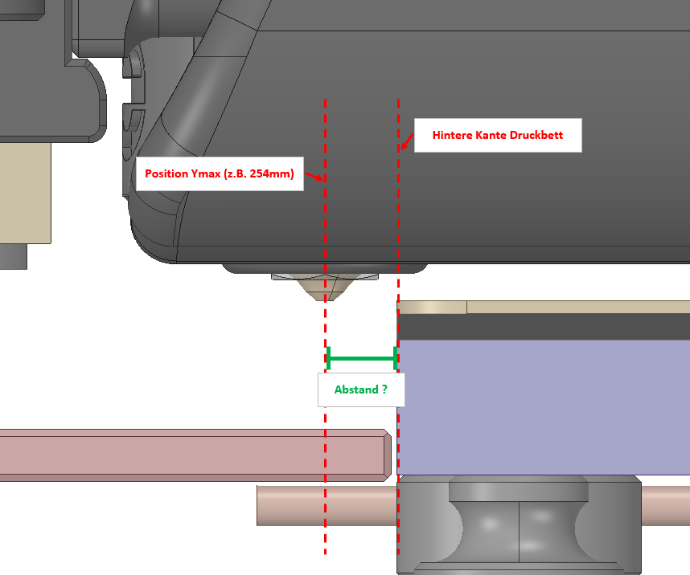
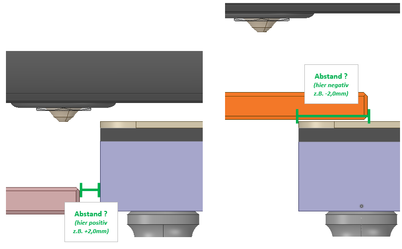
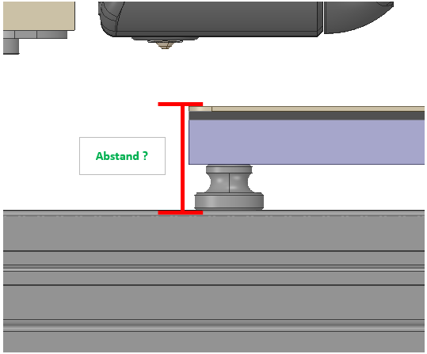
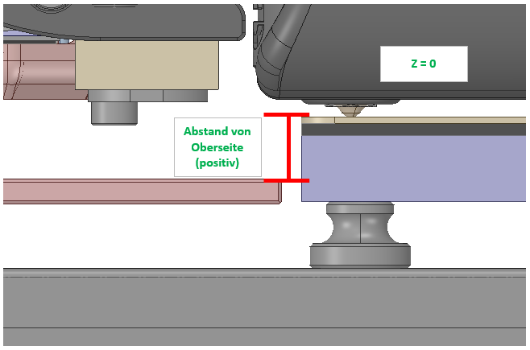
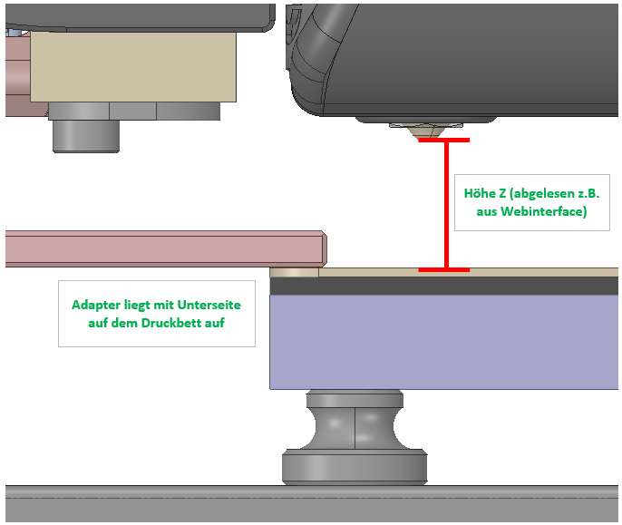

# Vorwort - Phase 1
Vielen Dank für dein Mitwirken beim **FPB**! :heart: 
 
Nachfolgend findest du die Informationen zu der jeweiligen Phase. 
 
Solltest du Fragen oder Anregungen haben, auf Probleme stoßen oder etwas überhaupt nicht funktionieren, dann melde dich über Discord (Direktnachrichten) an Nitro2k5#2432. 
 

# Gantry Mount
Es gibt zwei Varianten des Fixed-Klicky-Mounts, die lange und die kurze. 
 
Schau zunächst welche der beiden Klicky-Mounts du hast. 
 
 
*(links kurzer Mount, rechts langer Mount)* 
 
Wenn du den langen Mount hast, dann sind die "_ Long" Dateien für dich relevant. 
 
Wenn du den kurzen Mount hast, dann sind es die "_ Short" Dateien. 
 
Bitte drucke zunächst deinen passenden Measuring_Adapter_"X" und schraube ihn an den schon vorhandenen Klicky-Mount. 
 
Du findest die entsprechenden Druckdateien im STL-Ordner. 
 
Solltest du keinen Klicky-Mount haben, kannst du natürlich trotzdem mitmachen und diesen einfach ausdrucken und anbringen. 
 
Die Klicky-Mount-SLTs findest du im STL-Ordner und entsprechen den originalen Klicky-Dateien. 
 

# Print Settings

|Einstellung|Wert|
|---|:---:|
|Material|ABS/ABS+/ASA|
|Layerhöhe|0.2mm|
|Layerbreite|0.4mm|
|Wandlinien|4|
|Solid Top/Bottom Layer|5|
|Infill|Grid, Gyroid, Honeycomb, Triangle oder Cubic|
|Infill %|min. 40%|

 

# Montage
Der Klicky-Gantry-Mount wird mittig zur linken Bed-Extrusion an deiner Gantry montiert. 
 
Die genaue Position an der Gantry kann je nach Druckraumgröße unterschiedlich sein. 
 
 
 
# BOM - Phase 1
Vorausgesetzt du hast bereits einen Fixed-Klicky-Mount verbaut benötigst du: 

|Size|Qty|
|---|:---:|
|M3x8 SHCS|2|

 

Falls du noch keinen Klicky-Mount hast, benötigst du zusätzlich: 

|Size|Qty|
|---|:---:|
|M3 heat set insert|2|
|M5x10 BHCS|2|
|M5 roll-in T-Nut|2|

 

# Messung vorbereiten
Senke nun deine Gantry so weit ab, dass das Druckteil (Measuring Adapter) knapp über dem Druckbett schwebt. 
 
Falls das Druckteil hinter dem Bett weiter herunterfahren kann ohne das Bett zu berühren, senke die Gantry ab soweit bis die Nozzle auf Z0 ist. 
*(Abb. 1)* 
*oder* 
Falls das Druckteil auf dem Druckbett aufliegen würde, senkst du die Gantry so weit ab bis dies passiert. 
*(Abb. 2)* 
 

 
*(Abb. 1)* 
 

 
*(Abb. 2)* 
 

Der Adapter gilt aus Ausgangsreferenz für die nachfolgenden Messungen. 
 
Nachdem du die nachfolgenden Werte ermittelt hast, übersende uns doch bitte dein Feedback mit den nachfolgenden Fragen. 
 
Ein Foto (oder mehrere :smiley:) hierzu wäre weiter von großem Vorteil! 
 
# Zu erfassende Daten / Messwerte
*Du kannst den nachfolgenden Text ganz einfach kopieren und mit deinen Daten und Messwerten befüllen.* 
 

**Drucker-Modell?** 
*vermutlich V2.4r2 😊* 
 
**Theoretischer Druckraum** 
*z.B. 250x250x250 mm* 
 
**Modifizierter Frame oder Gantry abweichend zur BOM** 
Ja / Nein 
**Falls ja, welche Abweichungen?** 
*Freitext* 
 
**Größe Druckbett** 
*z.B. 250x250 mm* 
 
**Welche Druckbettauflage verwendest du?** 
*z.B. PEI Springsteel Sheet glatt* 
 
**Welche Dicke hat deine Druckbettauflage?** 
*z.B. 0,4 mm* 
**Welchen Toolhead verwendest du?** 
*z.B. StealthBurner* 
 
**Ist dein Toolhead modifiziert, sodass die ursprüngliche Nozzle-Position verschoben ist?** 
*Ja / Nein* 
 
**Welches Hotend verwendest du?** 
*z.B. Dragon HF* 
 
**Verwendest du Voron Tap?** 
*Ja / Nein* 
 
**Verwendest du weitere Mods die mit FPB interagieren könnten?** *z.B. Kinematic Bed Mount* 
*Ja / Nein* 
**Falls ja, welche?** 
*Freitext* 
 
**Ich hatte bereits einen fixed Klicky Mount (übrig)** 
*Ja / Nein* 
**Falls ja, den kurzen oder den langen?** 
*kurze Version / lange Version* 
**Falls nein, für welche Variante hast du dich entschieden** 
*kurze Version / lange Version* 
**Und warum?** 
*Freitext* 
 
**Ich finde den Klicky-Gantry-Mount nicht gut und würde mir stattdessen folgendes wünschen** 
*Freitext* 
 
**Ich hatte Probleme die Druckdateien auszudrucken** 
*Ja / Nein* 
**Falls ja, welche** 
*Freitext* 
 
**Ich hatte Probleme die Druckteile zusammenzubauen** 
*Ja / Nein* 
**Falls ja, welche** 
*Freitext* 
 
**Der Zusammenbau war für mich leicht verständlich** 
*Ja / Nein* 
 
**Hierzu wünsche ich mir weitere Details oder Erklärung** 
*Freitext* 
 
**Ich möchte als Mitmacher (Contributor) erwähnt werden** 
*Ja / Nein* 
**Falls ja, unter welchem Namen** 
*Freitext* 
 
**Folgendes ist mir aufgefallen, sollte verändert oder verbessert werden** 
*Freitext, offenes Feedback, Meinung, Optimierungen, etc.* 
 
 
**Messwerte Phase 1:** 
 
**Y_Max (`[stepper_y] @ position_max:`) laut Config?** 
 
**Kann Y Max problemlos wiederholgenau angefahren werden (unabhängig des FPB)?** *keine mechanischen Probleme, keine klemmende Cablechain, kein Halleffekt-Sensor der nicht wiederholgenau arbeitet, etc.* 
 
**Wie viel Abstand hast du in Y von Y_Max zur hintersten Kante des Druckbettes? (siehe Abb. 1)** *hier zählt die Mitte des Düsenaustritts* 
 
**Abstand Stirnseite Measuring-Adapter-Druckteil zur Kante Druckbett (siehe Abb. 2)** *kann positiv oder negativ sein* 
 
**Höhe Druckbett-Oberfläche zur bed-support-extrusion (Oberfläche) (siehe Abb. 3)** 
 
**Welchen Abstand hat die Ober- oder Unterseite des Measuring-Adapter-Druckteil zur Druckbett-Oberfläche wenn deine Nozzle bei Z0 ist? (siehe Abb. 4)** *Bitte gib an ob du von der Oberseite des Measuring-Adapters gemessen hast oder von der Unterseite.* 
*oder* 
**Auf welchem Z Wert steht deine Nozzle wenn die Unterseite des Measuring-Adapter-Druckteil auf der Druckoberfläche aufliegt? (siehe Abb. 5)** 
 
 

 

 

*(Abb. 1)* 

 

 

*(Abb. 2)* 

 

 

*(Abb. 3)* 

 

 

*(Abb. 4)* 

 

 

*(Abb. 5)* 
 
 

# :information_source: Und was ist mit dem Rest?
Sicherlich ist es spannend gleich alle Druckdateien des Flying Purge Buckets zu drucken und real zu testen - das Projekt ist aber noch ganz am Anfang und viele Dinge passen einfach noch nicht, sodass die Druckdateien erst nach den Erkenntnissen der Phase 1 zum Start der Phase 2 zu Verfügung stehen. 
 

# :information_source: Rückmeldung Feedback
Bitte sende dein Feedback vollständig ausgefüllt zusammen mit einem Foto des verbauten Adapters (am besten in „Messposition“) über Discord (Direktnachrichten) an Nitro2k5#2432. 
 
Deine Erkenntnisse werden in die weitere Entwicklung einfließen. 
 
Bei Rückfragen werden wir dich über Discord kontaktieren. 
 
Vielen Dank! :heart: 
 
