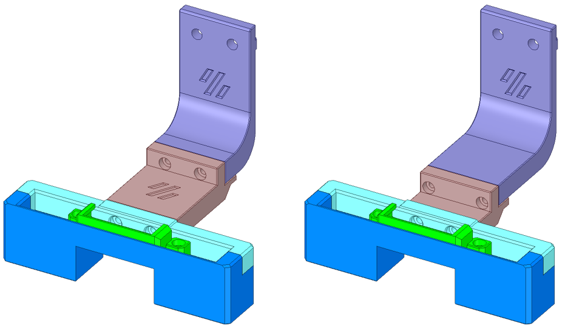
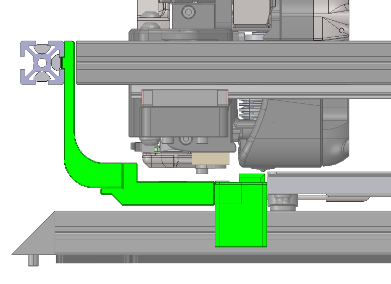
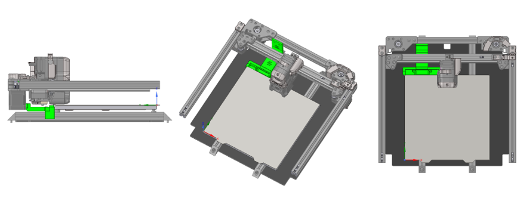

# :warning: BETA-Status :warning:

# :airplane: Flying Purge Bucket (FPB) | _a Voron Purge Bucket Mod_
Hey, vielen Dank für dein Interesse am Beta-Test des Flying Purge Buckets. 
 
Dieser Beta-Test wurde durch Mitglieder des **#landofschnitzel-:de:** Channels des Voron Discord initiiert. 
 
https://discord.gg/voron 
 
 
Sollte das Interesse der nicht-deutschsprachigen Community so groß sein, dass sich hier einige Mitmacher finden, werden alle Informationen und Texte ebenfalls auf Englisch bereitgestellt. 
 
## Was ist der Flying Purge Bucket :question:
Der **FPB** ist ein Gantry-mounted mitfahrender Purge Bucket (fliegend :airplane:) mit Nozzle Brush. 
 
Der Eimer und die Bürste sind zur Wartung und Reinigung magnetisch abnehmbar. 
 
Das Mitfahren in Z ermöglicht ein mid-print-purge (z.B. nach M600 ColorChange), sowie ein mid-print-nozzle-clean über die Bürste. 
 
Der **FPB** haucht den verwaisten Klicky-Mounts - die bedingt durch Voron Tap nun nicht mehr benötigt werden - neues Leben ein. :recycle: 
 
 
  
 
 
 
 
## Welche Voron-Printer werden unterstützt :question:
Zu Beginn wird nur der **V2.4r2** unterstützt. 
 
Der Trident hat bereits durch die fixed-Gantry die oben genannten Vorteile. 
 
## Ich würde gerne mitmachen, wie gehts nun weiter :question:
Der Beta-Test ist in verschiedene Phasen aufgeteilt und wird als Open-Beta-Test durchgeführt. 
 
Das bedeutet grundsätzlich kann jeder mitmachen und qualifiziertes Feedback geben. 
 
Dieses Feedback wird in die weitere Entwicklung des Projektes einfließen. 
 
**Kurz, du kannst beim Entwickeln des FPB aktiv mitmachen.** 
 
## Ablauf :information_source:
**Phase 1** befasst sich mit den maßlichen Gegebenheiten. 
 
Jeder Voron ist maßlich etwas anders, vor allem bei der Positionierung des Druckbettes gibt es zum Teil große Unterschiede. 
 
Damit der Flying Purge Bucket jedoch in jedes System passt, soll es verschiedene Adapter und Möglichkeiten geben. 
 
Hier sind wir auf die Erkenntnisse der Tester angewiesen um die Druckdateien später mal passend für möglichst viele Leute bereit stellen zu können. 
 
 
**Phase 2** befasst sich mit den maßlichen Gegebenheiten unter Berücksichtigung der Erkenntnisse aus Phase 1 im realen Einsatz im Zusammenspiel mit den automatischen mid-print-purge-macros, sowie den Erkenntnissen aus dem daily-use. 
 
 
In **Phase 3** fließen abschließend iterativ alle Änderungen und Erkenntnisse der Tester ein... 
 
&nbsp;&nbsp;&nbsp;&nbsp;&nbsp;&nbsp;...bis wir der Meinung sind "Das passt jetzt!". 
 
 
**Deine Erkenntnisse sind wichtig für die weitere Entwicklung des Projektes!** 
 
**Vielen Dank hierfür! :heart:** 
 
