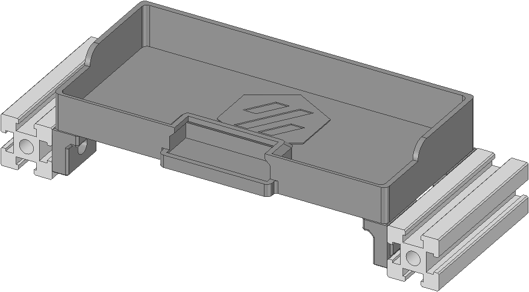

# Nozzle Brush Bed Pan
A removable Purge Bed Pan with integrated Nozzle Brush to close the gap behind the printbed after removing the Z endstop for Voron Tap.
  
You have to use a toolhead mounted probe (like Voron Tap) for this, because the stock Z endstop needs to be removed.
  

 

# BOM
|Size|Qty|
|---|:---:|
|Brass Brush|1|
|6x3mm Magnet|8|
|M3x6 SHCS|4|
|M3 T-Nut|4|

 

# Assembly
soon:tm:

 

# Compatibility

|V0|V1.8|V2.4|VSW|Trident|
|:---:|:---:|:---:|:---:|:---:|
| :x: | :x: | :heavy_check_mark: | :x: | :x: |

 

# Changelog
v1.0 (17.02.2023) - Release
  
Discord: Nitro2k5#2432
 
